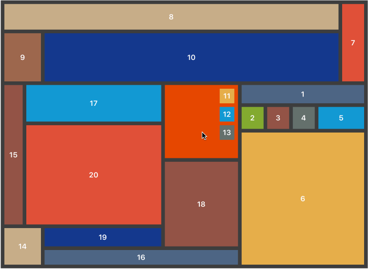
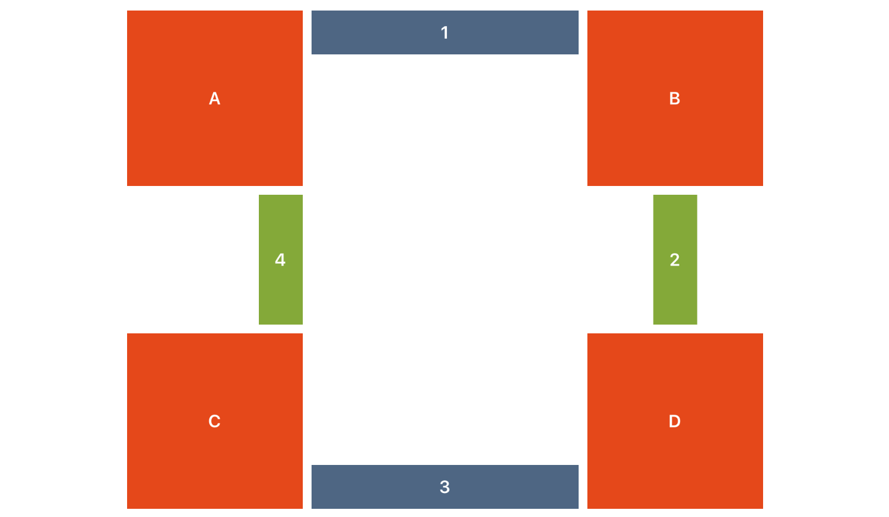

# Neon

### Build dynamic and beautiful user interfaces like a boss, with Swift.

Neon is built around how user interfaces are naturally designed - primary views are anchored to the sides / corners of the screen, and secondary views are laid out relative to them. Views expand and shrink to fill the screen, so building dynamic layouts that look great on the smallest phones all the way up to biggest tablets is quick and easy. No more springs and struts. No more whacky visual format language. No more auto layout contraints. We're not robots, so why should we build our UIs like we are?

### Neon is currently in beta, but more will be coming very soon, so stay tuned! In the meantime, here's an intentionally convoluted example to show how easy it is to build very complex and dynamic layouts with Neon. The following layout was created with only *20 lines of code*. That's one line of code per view!



---

## Anchoring Views

### Center

There are a few ways you can anchor views using Neon, and the first and most simple is anchoring a view in the center of its superview:

```swift
view1.anchorInCenter(width: size, height: size)
```


### Filling Superview

Sometimes you want a view to fill its superview entirely, which couldn't be easier.

```swift
view.fillSuperview()
```

Optionally, if you want a view to fill its superview with padding, you can provide padding instead:

```swift
view1.fillSuperview(left: padding, right: padding, top: padding, bottom: padding)
```


### Corner

The second anchoring method is anchoring a view in its superview's `Corner`. As you might have guessed, the four corners are `.TopLeft`, `.TopRight`, `.BottomLeft`, `.BottomRight`, and coupled with the `anchorInCorner()` function, you can easily anchor a view in any corner like this:

```swift
view1.anchorInCorner(.TopLeft, xPad: padding, yPad: padding, width: size, height: size)
view2.anchorInCorner(.TopRight, xPad: padding, yPad: padding, width: size, height: size)
view3.anchorInCorner(.BottomLeft, xPad: padding, yPad: padding, width: size, height: size)
view4.anchorInCorner(.BottomRight, xPad: padding, yPad: padding, width: size, height: size)
```


### Edge

`Edge` is another pretty obvious one to follow - it specifies on what edge of its superview a view will be anchored to. The four types are `.Top`, `.Left`, `.Bottom`, or `.Right`, and similar to previous examples, you can use the `anchorToEdge()` function to anchor a view to an edge:

```swift
view1.anchorToEdge(.Top, padding: padding, width: size, height: size)
view2.anchorToEdge(.Left, padding: padding, width: size, height: size)
view3.anchorToEdge(.Bottom, padding: padding, width: size, height: size)
view4.anchorToEdge(.Right, padding: padding, width: size, height: size)
```


### Filling an edge

Sometimes, you want to anchor a view against an edge, filling that edge; imagine something like a banner photo for a profile page. Again, this is made as simple as possible using the `anchorAndFillEdge()` function:

```swift
view1.anchorAndFillEdge(.Top, xPad: padding, yPad: padding, otherSize: size)
view2.anchorAndFillEdge(.Bottom, xPad: padding, yPad: padding, otherSize: size)
view3.anchorAndFillEdge(.Left, xPad: padding, yPad: padding, otherSize: size)
view4.anchorAndFillEdge(.Right, xPad: padding, yPad: padding, otherSize: size)
```


> Note that `anchorAndFillEdge()` accepts a parameter called `otherSize`. That parameter is used to set the *other size* that isn't automatically calculated by filling the edge, meaning that if you specify that you want to anchor to and fill the top edge, the width will be automatically calculated, but the height is still unknown, so the value passed in to `otherSize` will be used to set the height. Subsequently, if you want to anchor to and fill the left edge, the height is automatically calculated and `otherSize` will be used to set the width of the view.
> 


## Align

Now that we've anchored primary views, we can start making our UI more complex by aligning other views *relative to other sibling views*, using the (you guessed it) `Align` value. **Sibling views** are views that share the same superview directly. There are twelve `Align` types, and they are all pretty self-explanatory - here's an example using all nine with the `align()` function:

```
view1.align(.AboveMatchingLeft, relativeTo: anchorView, padding: padding, width: size, height: size)
view2.align(.AboveCentered, relativeTo: anchorView, padding: padding, width: size, height: size)
view3.align(.AboveMatchingRight, relativeTo: anchorView, padding: padding, width: size, height: size)
view4.align(.ToTheRightMatchingTop, relativeTo: anchorView, padding: padding, width: size, height: size)
view5.align(.ToTheRightCentered, relativeTo: anchorView, padding: padding, width: size, height: size)
view6.align(.ToTheRightMatchingBottom, relativeTo: anchorView, padding: padding, width: size, height: size)
view7.align(.UnderMatchingRight, relativeTo: anchorView, padding: padding, width: size, height: size)
view8.align(.UnderCentered, relativeTo: anchorView, padding: padding, width: size, height: size)
view9.align(.UnderMatchingLeft, relativeTo: anchorView, padding: padding, width: size, height: size)
view10.align(.ToTheLeftMatchingBottom, relativeTo: anchorView, padding: padding, width: size, height: size)
view11.align(.ToTheLeftCentered, relativeTo: anchorView, padding: padding, width: size, height: size)
view12.align(.ToTheLeftMatchingTop, relativeTo: anchorView, padding: padding, width: size, height: size)
```


## Align and fill

You don't always know or what to specify the size of a view that you want to layout relative to another, but rather you want to either fill the width, height, or the entire rest of the superview, after aligning with the sibling. Combined with all the different alignment types discussed earlier, we're starting to see how more complex layouts can be built very easily:

```swift
view2.alignAndFillWidth(align: .ToTheRightMatchingTop, relativeTo: view1, padding: padding, height: size / 2.0)
view4.alignAndFillHeight(align: .AboveCentered, relativeTo: view3, padding: padding, width: size / 2.0)
view6.alignAndFill(align: .ToTheLeftMatchingTop, relativeTo: view5, padding: padding)
```


## Align between

Sometimes you want a view to sit between to other views, filling the space between them. Using alignBetweenHorizontal() and alignBetweenVertical(), doing that is super easy! Choose one of your sibling views you want to align your view relative to and pass that in as your `primaryView`. We will use the specified `align` parameter to match that `primaryView` appropriately, and automatically fill either the horizontal or vertical span between the it and the `secondaryView`.

```swift
view1.alignBetweenHorizontal(align: .ToTheRightMatchingTop, primaryView: anchorViewA, secondaryView: anchorViewB, padding: padding, height: size)
view2.alignBetweenVertical(align: .UnderCentered, primaryView: anchorViewB, secondaryView: anchorViewD, padding: padding, width: size)
view3.alignBetweenHorizontal(align: .ToTheLeftMatchingBottom, primaryView: anchorViewD, secondaryView: anchorViewC, padding: padding, height: size)
view4.alignBetweenVertical(align: .AboveMatchingRight, primaryView: anchorViewC, secondaryView: anchorViewA, padding: padding, width: size)
```




## Grouping

Another common use-case is the *grouping* of sibling views, aligned in a row or column. Using what we've already learned about anchoring views in the center, in a corner, or against an edge, we can also do the same with groups of views!

The primary difference with grouping, is that it is done by the *parent view,* or `superview` of a group of views. For example, let's let two different views center a group of their subviews in each of the two different `Group` configurations, `.Horizontal` and `.Vertical`:

```swift
anchorViewA.groupInCenter(group: .Horizontal, views: [view1, view2, view3], padding: padding, width: size, height: size)
anchorViewB.groupInCenter(group: .Vertical, views: [view4, view5, view6], padding: padding, width: size, height: size)
```


How about grouping views in the corner?

```swift
anchorViewA.groupInCorner(group: .Horizontal, views: [view1, view2, view3], inCorner: .TopLeft, padding: padding, width: size, height: size)
anchorViewB.groupInCorner(group: .Vertical, views: [view4, view5, view6], inCorner: .BottomRight, padding: padding, width: size, height: size)
```


As you might have expected, you can also group either horizontally and vertically against any edge as well:

```swift
anchorViewA.groupAgainstEdge(group: .Horizontal, views: [view1, view2, view3], againstEdge: .Left, padding: padding, width: size, height: size)
anchorViewB.groupAgainstEdge(group: .Vertical, views: [view4, view5, view6], againstEdge: .Bottom, padding: padding, width: size, height: size)
```


## License

The source is made available under the MIT license. See LICENSE.txt for details.
